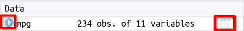

# Objetos en R {#objects}

En este capítulo veremos cómo crear un objeto en `r R()`, estudiaremos dos tipos de objetos destacados en `r R()`: los **vectores** y las **hojas de datos**, y aprenderemos a crear nuestras propias **funciones**.


## Crear un objeto 

La instrucción 

```{r}
x <- 2
```
crea una variable u objeto de nombre `x` y le asigna el valor $2$. 
El operador de asignación en `r R()` es `<-` (compuesto por el símbolo menor `<` y un guión central `-`).

Puedes comprobar que, después de ejecutar la instrucción anterior, el objeto `x` aparece listado en el panel *Environment* de la ventana superior derecha de `r RStudio()`. En este panel podemos ver todos los objetos definidos en nuestro entorno o espacio de trabajo (*workspace*).

Cuando se ejecuta una instrucción como la anterior, en la que se asigna un valor o expresión a un objeto, la salida no muestra el valor asignado. Para verlo tenemos que *imprimir* el objeto en cuestión, simplemente escribiendo su nombre: 
```{r}
x # muestra el valor actual de x
```

::: {.infobox data-latex=""} 
Otra alternativa para mostrar el valor de un objeto es delimitar la instrucción con la asignación entre paréntesis:
```{r}
(x <- 2) # asigna el valor 2 a la variable x y lo imprime
```

:::


Una vez definida el objeto o variable `x` podremos referenciarlo en cálculos posteriores. Por ejemplo, al ejecutar la instrucción

```{r}
x^2-3
```
obtendremos la salida $1$ (resultado de $2^2-3 = 1$).

## Vectores

Para crear **vectores** en `r R()` usamos la función `c` (inicial de *concatenate* o *combine*). La instrucción 
```{r}
v <- c(1, 3, 5, 7, 9)
```
crea un vector de nombre `v` formado por los primeros  $5$ números impares. Observa la entrada que se ha creado para `v` en el panel Environment.

Para acceder al elemento número `i` del vector `v` se escribe `v[i]` (ojo, que el primer índice es `1`, no `0`). Por, ejemplo para extraer el segundo elemento de `v` escribimos 
```{r}
v[2]
```


La instrucción 
```{r}
v^2
```
devuelve el vector cuyos elementos son los cuadrados de los elementos de `v`. 
La mayoría de funciones de `r R()` que reciben argumentos numéricos  aplicadas a un vector numérico operan sobre cada elemento del vector (se dice que están vectorizadas).

## Hojas de datos

Las hojas de datos (en inglés *data frames*) son la clase de objetos que se usan en `r R()` para almacenar los datos obtenidos en un experimento y poder analizarlos. 


Empezaremos explorando la hoja de datos de nombre `mpg` (**m**iles **p**er **g**allon), proporcionada por el paquete `ggplot2`(que ya hemos cargado al cargar el paquete `tidyverse`). Esta hoja de datos trata sobre el consumo de combustible de diferentes modelos de coches.


Para cargar la hoja de datos `mpg` en tu espacio de trabajo escribe
```{r}
data("mpg")
```
Verás que `mpg` aparece listada en el panel Environment. Inicialmente está catalogada como `<Promise>`, pero en cuanto hagamos click en esa celda (o escribamos el nombre de la variable para usarla en nuestro código), se completará la carga y podremos leer  que tiene $234$ observaciones de $11$ variables. Utilizando los iconos que se resaltan en la imagen siguiente, obtenemos más  información sobre la hoja de datos.

```{r, echo = FALSE, out.width="60%"}

```


* Presionando el icono de la izquierda, vemos los nombres de las 11 variables y sus valores para las primeras observaciones. 

* Presionando el icono de la derecha, podremos visualizar la hoja de datos completa. El dato en la celda correspondiente a la fila $i$ y la columna $j$ es el valor observado para el coche número $i$ de la variable número $j$.  

En general, una hoja de datos es una especie de matriz u hoja de cálculo, donde las filas representan unidades experimentales, casos u observaciones (en nuestro ejemplo coches) y las columnas representan variables que describen características de interés de las unidades experimentales (en nuestro caso fabricante, modelo, cilindrada, consumo de combustible ...). Las celdas contienen los valores observados para cada variable en cada unidad experimental. 

Para obtener una descripción de la hoja de datos, escribe `mpg` en el campo de búsqueda del panel **Help** de `r RStudio()`. También puedes escribir `?mpg` o `help(mpg)` en la consola, o poner el cursor sobre cualquier punto de la palabra `mpg` en la instrucción `data("mpg")` y presionar `F1`. La página de ayuda explica que la hoja de datos tiene  $234$ filas, donde cada fila representa un coche, y $11$ variables, que describen diferentes características de los coches. Las  variables que utilizaremos después son `displ`, `hwy` y `class`, que nos describen como:

* `displ`: *engine displacemente, in litres* (cilindrada)
* `hwy`: *higway miles per gallon* (millas recorridas por galón de combustible en conducción por autopista)
* `class`: *"type" of car*

Para extraer las cilindradas (variable `displ`) de la hoja de datos `mpg` utilizamos la instrucción siguiente:
```{r}
mpg$displ
```
que mostrará el vector con las cilindradas de los $234$ coches.
En general, para extraer una de las variables de una hoja de datos se utiliza el formato `<nombre hoja>$<nombre variable>`.  

Podemos ver los diferentes tipos de coches incluidos en la variable `class` con

```{r}
unique(mpg$class)
```


El propósito de este apartado era presentar las hojas de datos en `r R()` y describir su estructura. En el capítulo [Crear hojas de datos](#tibbles) veremos cómo crear nuestras propias hojas de datos, bien de forma manual, bien importando los datos de un archivo. 


## Funciones

Hasta ahora hemos visto cómo utilizar algunas de las funciones predefinidas en `r R()`, pero en ocasiones necesitamos definir nuestras propias funciones. En este apartado veremos cómo hacerlo a través de un par de ejemplos.

El código a continuación define una función de nombre `add_two` que suma $2$ al valor que recibe como argumento:

```{r}
add_two <- function(x){
    x+2
}
```

Para utilizar la función que acaba de definirse escribiríamos
```{r}
add_two(5)
```

Veamos un segundo ejemplo. Consideremos la función 
\[ f(x) = a + be^{cx} \]
que depende de tres parámetros \( a \), \( b \) y \( c \). Para evaluar está función en un determinado  valor de la variable independendiente \( x \) y valores concretos de los parámetros \( a \), \( b \) y \( c \) definiríamos la siguiente función de `r R()`:

```{r}
myfun <- function(x, a, b, c){
    a + b*exp(c*x)
}
```

Si queremos calcular \( f(4) \) siendo \( a = 1 \), \( b = 2 \) y \( c = 3\) usaríamos

```{r}
myfun(4, 1, 2, 3)
```

Como puede verse en los ejemplos anteriores, para definir una función en `r R()`:

- Se indica el nombre de la nombre de la función (como `add_two` o `myfun`) y se utiliza el operador de asignación `<-`, como para definir cualquier otro objeto.

- Se escribe la palabra clave `function` y entre paréntesis los nombres de los argumentos.

- Entre llaves, se escribe el cuerpo de la función, con el código que queremos ejecutar. En dicho código nos referiremos a los argumentos con los nombres que hayamos declarado antes entre paréntesis. El cuerpo de las dos funciones de nuestros ejemplos se limita a una única instrucción, pero en general puede contener un número arbitrario de líneas, donde cada línea puede ser cualquier instrucción de `r R()` que puede hacer uso de los argumentos y de otros objetos definidos en instrucciones previas. 

- La última expresión escrita en el cuerpo de la función será la salida de la función, que se imprimirá al llamarla. Nuestros dos ejemplos devuelven un valor numérico, pero una función puede devolver un objeto de cualquier otro tipo como un vector, una lista o una hoja de datos. 
<!-- Las funciones que necesitaremos definir en las prácticas de este curso serán de dificultad similar a las de los dos ejemplos de este apartado. -->

::: {.infobox data-latex=""}
La llamada `myfun(4, 1, 2, 3)` asigna los valores a los argumentos en el orden en que se especificaron en la definición de la función. Como al  definir `myfun` especificamos los argumentos en el orden `x, a, b, c`, la llamada  `myfun(4, 1, 2, 3)` ejecuta la función con las asignaciones `x = 4`, `a = 1`, `b = 2` y `c = 3`. 

Si escribimos explícitamente los nombres de los argumentos de una función, podemos indicarlos en cualquier orden. Por ejemplo:

`myfun(a = 1, b = 2, c = 3, x = 4)`

sería equivalente a `myfun(4,1,2,3)`.
:::


 

