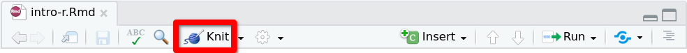
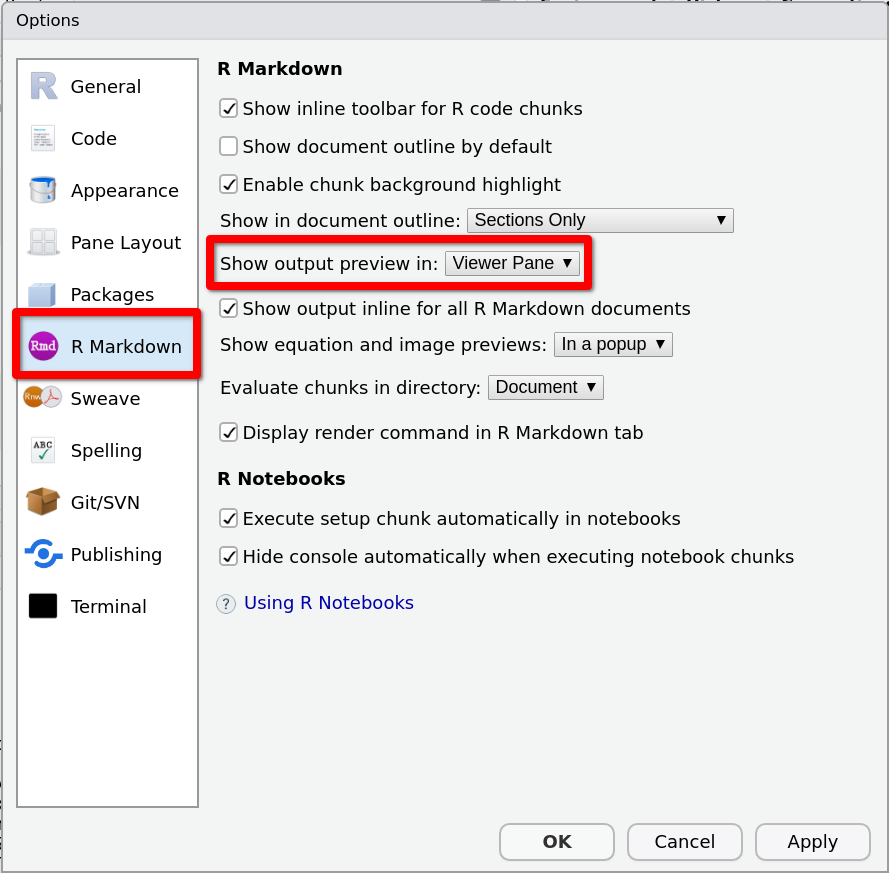
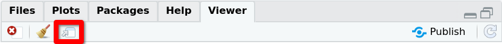

#  Escribir y ejecutar código de R {#rmarkdown}

Para escribir y ejecutar código de `r R()` desde `r RStudio()` podremos utilizar bien la consola o bien escribir nuestro código en un archivo.

La **consola** se utiliza para ejecutar instrucciones sueltas, que no tenemos interés en conservar, por ejemplo para realizar cálculos auxiliares o para instalar paquetes.

Cuando el código que queremos escribir sea un conjunto de instrucciones que queramos conservar, de forma que podamos reutilizarlo posteriormente o compartirlo con otras personas, escribiremos nuestro código en un archivo.
Entre los tipos de archivos que podemos crear desde `r RStudio()` para escribir y ejecutar código `r R()` están los **scripts** y los documentos **R Markdown**. 


<!-- Además, podremos organizar nuestro trabajo usando los proyectos de `r RStudio()`. -->


## Consola

En  `r RStudio()` encontrarás la consola en el panel de nombre `r textsf("Console")` en la ventana a la izquierda de la pantalla.


Para calcular $\sqrt{2}$ desde la consola, sitúa el cursor al lado del símbolo `>` en la consola, escribe la instrucción `sqrt(2)` y presiona `Enter`. Verás la salida  debajo:

<!-- ```{r, echo=FALSE} -->
<!-- if (knitr:::is_latex_output()) { -->
<!--     #knitr::asis_output('\\url{....}') -->
<!--     knitr::include_graphics("https://raw.githubusercontent.com/EMazcunan/public-files/master/ule/ule-logo.png") -->
<!-- } else { -->
<!--   knitr::include_graphics("https://media.giphy.com/media/xUOxf7XfmpxuSode1O/giphy.gif") -->
<!-- } -->
<!-- linguisticsdown::include_graphics2("https://media.giphy.com/media/xUOxf7XfmpxuSode1O/giphy.gif", "https://raw.githubusercontent.com/EMazcunan/public-files/master/ule/ule-logo.png") -->
<!-- ``` -->


```{r, comment="", prompt=TRUE, class.source='console-source', class.output='console-output', highlight=FALSE}
sqrt(2)
```


## Scripts de R

Los scripts de R son el tipo de archivo más simple para escribir y ejecutar código de `r R()`. 

Para crear un script, utiliza el menú 

::: {.menu data-latex=""}
File > New File > R Script
:::

El script se abrirá en una pestaña de una nueva ventana sobre la ventana con el panel de la consola. Este script no es más que un archivo de texto, que se guardará con la extensión `.R`.

Escribe en la primera línea del script la instrucción 
```md
sqrt(3)
```

Para ejecutarla, sitúa el cursor sobre cualquier punto de la línea y presiona `Ctrl + Enter`. Verás la salida en la consola. 

Si en un script queremos incluir varias instrucciones, cada nueva instrucción debe comenzar en una nueva línea. 

Añade una nueva línea al script para calcular la raíz de $5$, de forma que el contenido del script quede:

```md
sqrt(3)
sqrt(5)
```

Para ejecutar las dos instrucciones al mismo tiempo, selecciona las dos líneas y presiona de nuevo `Ctrl + Enter`. En la consola, verás las dos instrucciones y su salida correspondiente.

Pueden dejarse tantas líneas en blanco como se quiera entre diferentes instrucciones, y también dividir el código de una misma instrucción en varías líneas. Por ejemplo: 

```md
sqrt(3)

sqrt(
    5
)
```

Notar que si situamos el cursor sobre cualquiera de las tres líneas que componen la segunda instrucción para calcular la raíz de $5$ y presionamos `Ctrl + Enter`, `r RStudio()` reconoce que la línea en la que tenemos el cursor forma parte de una instrucción compuesta por varias líneas y ejecuta todas ellas. 


Para añadir comentarios en un script, se utiliza el carácter `#`: Al ejecutar una línea de código, todo el texto escrito después del carácter `#` será  ignorado.  Puedes escribir por ejemplo 

```md
# calcular raíces 
sqrt(3)
```

o 

```md
sqrt(3) # calcular la raíz de 3
sqrt(5) # calcular la raíz de 5
```

Crea ahora una carpeta, de nombre`IntroR`, para guardar el script que acabas de escribir y otros documentos que generaremos a lo largo de la práctica. 


Para guardar el script que acabas de escribir, presiona `Ctrl + S` (o utiliza el correspondiente icono en la barra de herramientas del archivo). 

Si aparece un cuadro de diálogo preguntando por la codificación del archivo, selecciona la codificación que aparezca listada en primer lugar como defecto para tu sistema operativo (verás el texto (System default) al lado de su nombre). 

En el selector de archivos que se abrirá a continuación, navega hasta la carpeta `IntroR` que has creado antes e indica `script` como nombre del archivo. Verás entonces que la etiqueta de la pestaña del script en el panel de RStudio cambia de `Untitled1` a `script.R`.

## Documentos R Markdown

Nuestra elección para realizar las prácticas y tareas de esta asignatura será utilizar documentos R Markdown.  En un documento R Markdown podremos escribir tanto código `r R()` como texto. Y al compilarlo obtendremos un documento que incluirá el código, la salida resultante de ejecutar el código, y el texto explicativo. 

* En el texto podremos utilizar la sintaxis propia del lenguaje de marcado [Markdown](https://es.wikipedia.org/wiki/Markdown){target="_blank"} (independiente de `r R()`). Por ejemplo: 
```md
El resultado anterior permite extraer una conclusión muy **importante**.
```

* Y el código de `r R()` se incluirá en unos bloques especiales, que tendrán la estructura 
````md
```{r [etiqueta], [opciones]}`r ''`
<código R>
```
````


### Creación
Para crear tu primer documento R Markdown utiliza el menú 

::: {.menu data-latex=""}
File > New File > R Markdown ...
:::

Aparecerá un cuadro de diálogo de nombre **New R Markdown**.

```{r, echo=FALSE}
knitr::include_graphics("images/new-r-markdown.png")
```

Rellena 'Introducción a R y RStudio' en el campo **Title** y tu nombre en el campo **Author**. Para el campo **Default output format**, conserva la elección 'HTML' que aparece por defecto. 

Al presionar el botón **OK** se abrirá una nueva pestaña en el panel de `r RStudio()` con el nuevo documento R Markdown. Presiona `Ctrl + S` para guardarlo, en la carpeta `IntroR` que creaste antes para la práctica, con el nombre `intro-r`. Verifica que la etiqueta de la pestaña del documentocambia de `Untitled1` a `intro-r.Rmd`.

Las primeras líneas del archivo (1 a 6), delimitadas por tres guiones (`---`) 

```md
---
title: "Introducción a R y RStudio"
author: "Eva"
date: "19/4/2021"
output: html_document
---
```
conforman  la llamada cabecera YAML del documento. Incluye metadatos como el título, el autor y la fecha y el formato de salida del documento que se generará al compilar. 

Las líneas siguientes (8 a 10)
````md
```{r setup, include=FALSE}`r ''`
knitr::opts_chunk$set(echo = TRUE)
```
````
las analizaremos con más detalle en la sección \@ref(global-options). 


El resto de líneas (12 en adelante), son los contenidos propiamente dichos del documento. Se trata de unos contenidos de muestra, que enseguida reemplazaremos por nuestros contenidos propios. Pero antes de borrar estos contenidos de muestra, compilaremos el documento para ver el resultado inicial. 

### Compilación

Para compilar el documento presiona el botón **Knit** en la barra de herramientas de la pestaña del archivo. 

```{r, echo=FALSE}

```

El documento compilado aparecerá en el panel **Viewer**, en la ventana de la zona derecha inferior. 
Si el documento no se abre en este panel, sino en una ventana emergente, cierra esa ventana y modifica este comportamiento siguiendo los siguientes pasos:

1. Selecciona el menú 

::: {.menu data-latex=""}
Tools > Global Options
:::

2. Se abrirá una ventana de nombre **Options**. Selecciona la sección **R Markdown** en el menú lateral e indica 

::: {.menu data-latex=""}
Show output preview in: Viewer Pane
:::
como indica la imagen siguiente:
```{r, echo=FALSE}

```

Si miras los contenidos de la carpeta `IntroR` (puedes hacerlo desde el panel **Files** de `r RStudio()`) verás que, como resultado de la compilación del archivo fuente `intro-r.Rmd`, se ha creado el archivo de salida `intro-r.html`. Éste es el archivo que estamos visualizando en el visor de documentos. También podríamos abrirlo en el navegador web, pudiendolo hacer desde el propio visor, presionando el icono resaltado en la siguiente imagen: 

```{r, echo=FALSE}

```

A continuación compararemos el documento fuente `intro-r.Rmd` con el documento `intro-r.html` en el visor, para entender cómo se traducen los contenidos que escribimos en un archivo R Markdown en el formato de salida HTML. Nos fíjaremos en particular en los siguientes elementos: encabezados y bloques de código, que se describen en los dos siguientes apartados.


### Encabezados

Las líneas 12
```md
## R Markdown 
```
y 22
```md
## Including Plots
```
se traducen en la salida como encabezados de secciones. Si inspeccionas el código del archivo `intro-r.html` verás que se crean elementos de tipo `<h2>`. En general,
```md
# Título
```
produce un encabezado de nivel 1, 
```md
## Título
```
un encabezado de nivel 2, y así sucesivamente. 

Hay que indicar que es una casualidad la coincidencia del símbolo `#` para encabezados en el lenguaje Markdown (independiente de `r R()` ) y para comentarios en código `r R()`.


### Bloques de código

Los elementos protagonistas del documento son los bloques de código `r R()` (*code chunks*). En el documento de muestra encontramos dos bloques de código: El primero en las líneas 18-20
````md
```{r cars}`r ''`
summary(cars)
```
````
y el segundo en las líneas 26-28
````md
```{r pressure, echo=FALSE}`r ''`
plot(pressure)
```
````

Si miras el documento compilado, verás que, para el primer bloque se muestra el código y a continuación la salida o resultado de su ejecución; mientras que para el segundo, se muestra solo la salida, y no el código. Esto es debido a la opción `echo=FALSE`. 


Como se indicó al principio de la sección, la sintaxis general para incluir un bloque de código `r R()` en un documento R Markdown es la siguiente:
````md
```{r [etiqueta], [lista de opciones]}`r ''`
<código R>
```
````

Las etiquetas de los dos bloques de código del documento de muestra son `cars` y `presure`. La etiqueta de un bloque de código sirve para identificarlo, podemos interpretarlo como su nombre, pero es opcional y puede omitirse.

El primer bloque de código no tiene ninguna opción. Y el segundo tiene la opción `echo=TRUE`, que como acabamos de decir inhibe la impresión del código en el documento compilado.

Puesto que la etiqueta y la lista de opciones son opcionales, el esqueleto básico de un bloque de código `r R()` incluido en un documento R Markdown es
````md
```{r}`r ''`
<código R>
```
````
En el cuerpo del bloque podemos escribir instrucciones de `r R()` igual que si estuvieramos escribiendo en un script (incluidos comentarios precedidos por el carácter `#`). 

Notar el cambio de enfoque al escribir en un documento R Markdown respecto a escribir en un script:

* En un script, se espera que escribamos código `r R()`, y para escribir texto ordinario hemos de usar comentarios utilizando el carácter `#`

* Por el contrario, en un documento R Markdown, se espera que escribamos texto (con posibilidad de incluir la sintaxis propia del lenguaje Markdown), y para escribir código `r R()` hemos de incluirlo en un bloque especial delimitado por la línea ` ```{r} ` al comienzo  y la línea  ` ``` ` al final.


<!-- ## Proyectos -->
