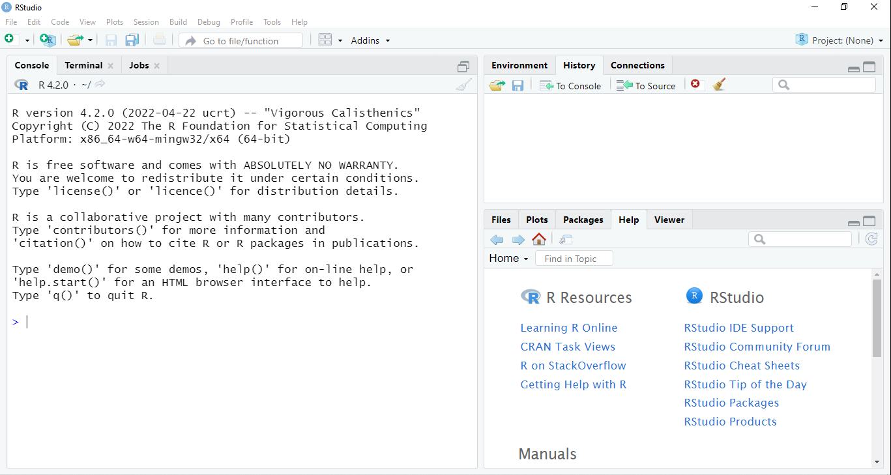
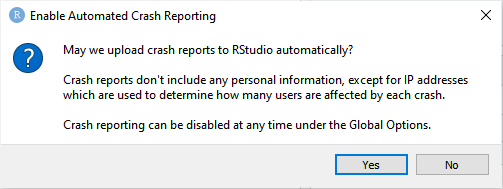

# Interfaz de `r RStudio()` {#rstudio}
Al abrir `r RStudio()` verás una pantalla como la de la imagen a continuación. 

```{r, echo=FALSE, fig.cap="Interfaz de RStudio", out.extra={if(knitr::is_html_output()){'style="border:1px solid gray;"'}}}

```

La interfaz está dividida en varias regiones con varias pestañas o paneles. Empezaremos usando la consola, que es el panel en la parte izquierda de la pantalla de nombre **Console**. Más adelante exploraremos nuevos paneles y veremos su utilidad. 


::: {.infobox data-latex=""}
La primera vez que abras `r RStudio()` aparecerá un cuadro de diálogo preguntando si deseas habilitar el envío automático de informes de fallos. 

```{r, echo=FALSE, fig.cap="Solicitud de envío automático de informes de fallos de RStudio", out.width="90%", out.extra={if(knitr::is_html_output()){'style="border:1px solid gray;"'}},}

```

Puedes realizar la elección que desees, teniendo en cuenta que no perderás ninguna funcionalidad si no lo habilitas.  
:::

