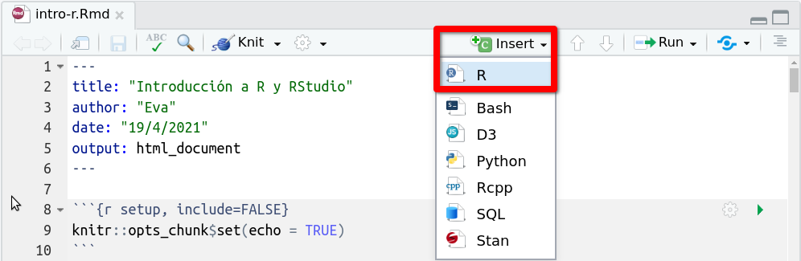
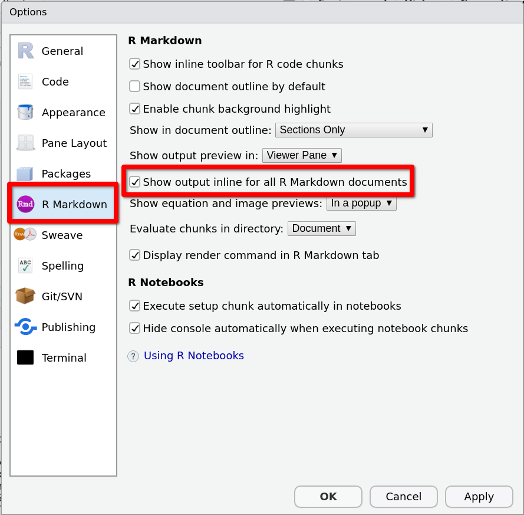
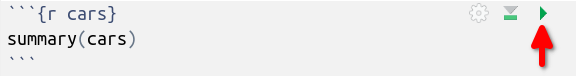

# Plantilla de R Markdown

Ahora vamos a reemplazar los contenidos de muestra del archivo de R Markdown que hemos creado por nuestros propios contenidos. Crearemos un primer capítulo con un primer bloque código y dejaremos el documento preparado para practicar el código de `r R()` que se presenta en los siguientes capítulos. 

## Primeros contenidos

Borra los contenidos de muestra (línea 15 en adelante) y añade la siguiente línea para crear un encabezado de nivel 1:


```md
# Bloques de código
```

Ahora vamos a crear un primer bloque de código. Para escribir su esqueleto usa el atajo 

::: {.menu data-latex=""}
`Ctrl + Alt + I` 
:::

(`I` de *Insert*) o, alternativamente, el menú 

::: {.menu data-latex=""}
Insert > R
:::

en la barra de herramientas de la pestaña del documento, que se muestra en la siguiente imagen:

```{r, echo=FALSE}

```

En el bloque de código que acabas de crear añade las instrucciones 

````md
sqrt(8)
sqrt(10)
````
de forma que los contenidos añadidos queden:

````md
# Bloques de código

```{r}`r ''`
sqrt(8)
sqrt(10)
```
````

Compila para ver el resultado. 

## Algunas opciones

Tras compilar el documento, verás que en el documento HTML generado aparecen:

* El código de la primera instrucción `sqrt(8)`
* Su salida `r sqrt(8)`
* El código de la segunda instrucción `sqrt(10)`
* Su salida `r sqrt(10)`

Si prefieres que se muestre primero el código para las dos instrucciones y a continuación las dos salidas, añade la opción `results='hold'`:

````md
```{r, results='hold'}`r ''`
sqrt(8)
sqrt(10)
```
````
y vuelve a compilar para ver el resultado. 

Si quieres omitir los caracteres `##` al comienzo de las líneas de la salida, añade la opción `comment = ''`. 

## Opciones globales

Al comienzo de nuestro documento, hemos conservado el bloque de código 
```` md
```{r setup, include=FALSE}`r ''`
knitr::opts_chunk$set(echo = TRUE)
```
````
que estaba incluido en el documento de muestra.

Las opciones especificadas en el argumento de  `knitr::opts_chunk$set` aplicarán a todos los bloques de código que se incluyan en el documento. 


Si se desea aplicar  las opciones `results='hold'` y `comment = ''` que se explicaron antes, a todos los bloques de código del documento, las añadiremos al argumento de la función `knitr::opts_chunk$set`, de forma que quede:
````md
knitr::opts_chunk$set(
    echo = TRUE,
    results='hold',
    comment = ''
)
````
En tal caso, estas dos nuevas opciones aplicarán a todos los bloques, sin necesidad de repetirlas de forma individual en cada uno de ellos, y puedes borrarlas del bloque de código que creaste antes. 

## Ejecución individual de un bloque de código

Cuando compilamos un documento R Markdown, se ejecutan todos los bloques de código que contenga, y en el documento compilado podemos visualizar, para cada bloque, el código y la salida (si no hay opciones como `echo=FALSE` que inhiban la impresión del código y/o de la salida).

Pero también podemos ejecutar determinadas instrucciones en un bloque de código de forma individual, sin necesidad de compilar el documento completo. 
Para ello, podemos proceder exactamente igual que en el caso de los scripts, es decir:

* Para ejecutar una sola instrucción, situamos el cursor en cualquiera de las  líneas que compongan la instrucción y presionamos `Ctrl + Enter`. 

* Para ejecutar varias instrucciones, seleccionamos las correspondientes líneas y presionamos `Ctrl + Enter`.


La salida se mostrará en la consola, y también  incrustada en el propio documento, justo debajo del bloque de código. Para esto último ha de estar marcada la opción **Show output inline for all R Markdown documents** en las opciones para R Markdown, como muestra la siguiente imagen:
```{r, echo=FALSE}

```


Además, podemos ejecutar todas las instrucciones que componen un bloque de código utilizando el botón a la derecha del comienzo del bloque que se resalta en la siguiente imagen:

```{r, echo=FALSE, out.width="80%"}

```

## Tabla de contenidos flotante 

Ahora vamos a personalizar el formato de salida para que nuestro documento incluya una tabla de contenidos flotante y para numerar los capítulos. 

Para ello modificamos la línea

```md
output: html_document
```
en la cabecera YAML por 
```md
output: 
    html_document:
        toc: true
        toc_float: true
        number_sections: true
```

Asegúrate de indentar las líneas conforme se indica, porque el indentado es fundamental para que los campos anidados se lean correctamente en el proceso de compilación. 

Para que nuestra tabla de contenidos tenga más de una entrada, añade al final del documento un segundo capítulo, con el título del siguiente capítulo de esta práctica: 
````md
# Paquetes
````

Compila de nuevo y abre el resultado en el navegador. Verás la tabla de contenidos con los títulos de los capítulos numerados.

Hasta que el documento no tenga la extensión suficiente para ocupar la pantalla completa y que aparezca la barra de *scroll* para recorrerlo, no se apreciará la funcionalidad completa de la tabla de contenidos flotante. 

## Resumen

Después de los cambios que hemos ido haciendo en el documento de muestra, ha debido quedarte así:

````md
---
title: "Introducción a R y RStudio"
author: "Eva"
date: "19/4/2021"
output: 
    html_document:
        toc: true
        toc_float: true
        number_sections: true
---

```{r setup, include=FALSE}`r ''`
knitr::opts_chunk$set(
    echo = TRUE,
    results='hold',
    comment = ''
)
```

# Bloques de código

```{r}`r ''`
sqrt(8)
sqrt(10)
```

# Paquetes 
````
## Flujo de trabajo

La idea es que, conforme vayas estudiando el resto de capítulos de esta práctica, continúes escribiendo en el documento R Markdown que tienes ahora. 

La idea es que crees un nuevo capítulo por cada capítulo de la práctica, e incluyas  bloques de código para practicar el código de `r R()` que vayas encontrando en la práctica, así como el texto que creas oportuno para documentar el código y entenderlo cuando releas el documento. Experimenta, escribiendo el código que te apetezca para probar las ideas que te vayan surgiendo y escribiendo el texto que consideres para explicarlas.

Puedes ir compilando cada bloque o instrucción de forma individual, para ver su salida *inline* y compilar el documento cada cierto tiempo. 
